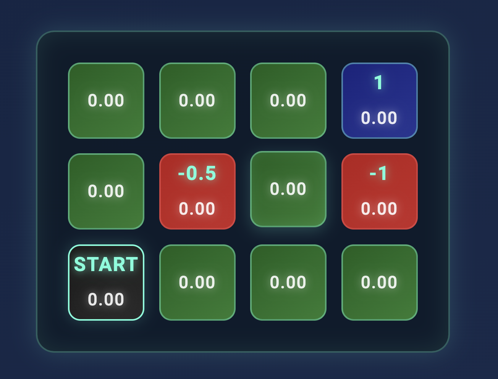
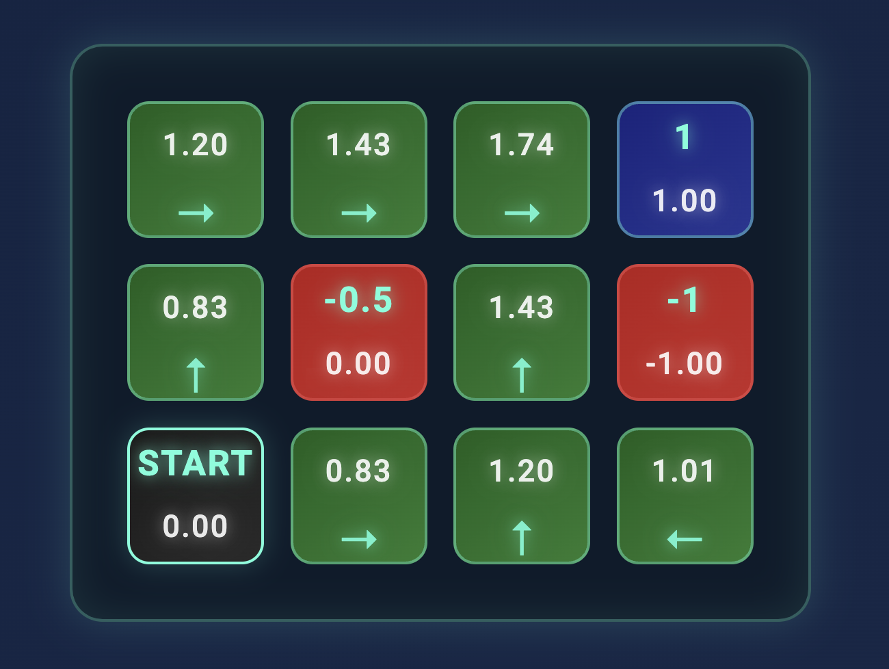

# MDP Game

## Overview

The **MDP Game** is an interactive implementation of a grid-based Markov Decision Process (MDP). MDPs are widely used in **Artificial Intelligence**, especially in decision-making and reinforcement learning, making them a cornerstone concept in AI research and applications.. The game enables users to create a custom grid, assign rewards to specific cells, and visualize the optimal path determined by the value iteration algorithm. This project is built using HTML, CSS, and JavaScript.

## Features

- **Dynamic Grid Creation**: Customize the grid dimensions (rows and columns).
- **Adjustable Parameters**:
  - Discount Factor (γ): Controls the weight of future rewards.
  - Transition Probability: Specifies the likelihood of the intended action being executed.
- **Value Iteration Algorithm**: Computes optimal policies and value functions.
- **Interactive Reward Editing**: Modify rewards for specific cells directly on the grid.
- **Visualization**:
  - Display cell values and optimal policies.
  - Track iterations with a history table.

## Getting Started

### Installation

1. Clone the repository:
   ```bash
   git clone https://github.com/yourusername/mdp-game.git
   ```
2. Navigate to the project directory:
   ```bash
   cd mdp-game
   ```
3. Open `index.html` in any modern web browser to run the game.

## OR

Open this link: https://prateekg93.github.io/MDP-Game/

### Prerequisites

No additional dependencies or installations are required. Just ensure a browser supports modern HTML5 and JavaScript features.

## Instructions

1. Open the game in a browser.
2. Set the grid dimensions (rows and columns) using the controls.
3. Adjust the discount factor (γ) and transition probability sliders as needed.
4. Click **Create Grid** to generate the grid.
5. Modify rewards:
   - Click on any cell to open the reward editor.
   - Enter a new reward value and save.
6. Click **Start Value Iteration** to begin the algorithm:
   - Observe the values and policies updating in real-time.
7. Track the history of iterations in the table below the grid.
8. Reset values or restart the process anytime using the provided buttons.

## Game Mechanics

- **Start Cell**: The starting point of the agent is indicated with the label "START" and a black background.
- **Rewards**:
  - Positive values represent rewards (e.g., goals).
  - Negative values represent penalties (e.g., obstacles).
  - Zero values represent neutral states.
- **Optimal Policy**: Displayed with directional arrows (→, ←, ↑, ↓) indicating the best action for each cell.

## Files

- **index.html**: The main HTML structure.
- **style.css**: Styling and visual design.
- **script.js**: Core logic for grid generation, value iteration, and user interactions.

## Contributions

Contributions are welcome! Feel free to fork the repository and submit pull requests.

## License

This project is licensed under the MIT License. See the LICENSE file for details.

## Author

Prateek Goswami

## Example Images

Here are examples of the game in action:






